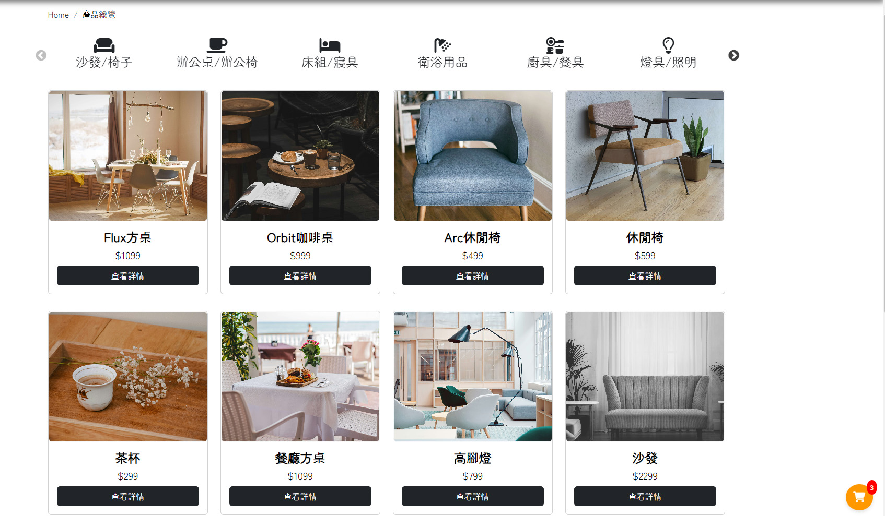

# Modernist Lines家具工坊網頁設計
測試帳號(暫不可用)
 
帳號:testuser
 
密碼:Testuser01
 
https://skyrain1234.github.io/myproject/

## 目錄
- [畫面展示](#畫面展示)
- [專案技術](#專案技術)
- [功能](#功能)

## 畫面展示

- 首頁畫面展示

- 商品總覽

- 後臺管理系統

## 專案技術
- [Bootstrap v5.2.3]
- [jQuery v3.7.1]
- [jQuery UI - v1.13.2]
- [AdminLTE v3.2.0]
- [Vue.js]
- [Axios]
- [Chart.js v4.4.2]
- [slick.js]
- [SweetAlert2]
## 功能

前台
- RWD響應式網站
- 會員登入系統
- 留言系統
- 產品分類
  [購物車系統

後台管理系統
- 會員與產品管理
- 會員資料分析圖表
- 全臺會員分布地圖
- 留言管理與未讀留言提醒
- 頁面跳轉功能

